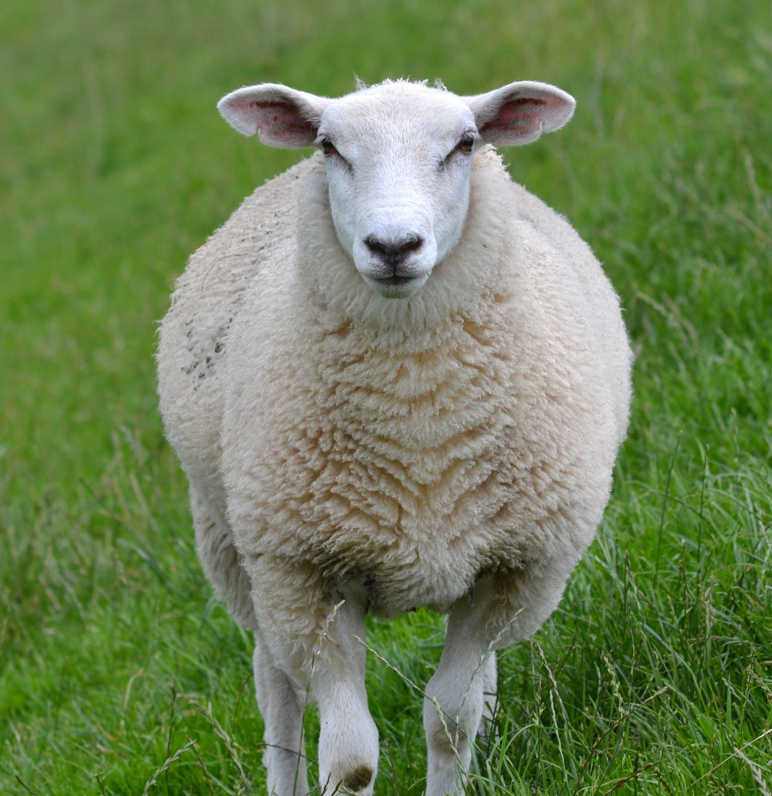
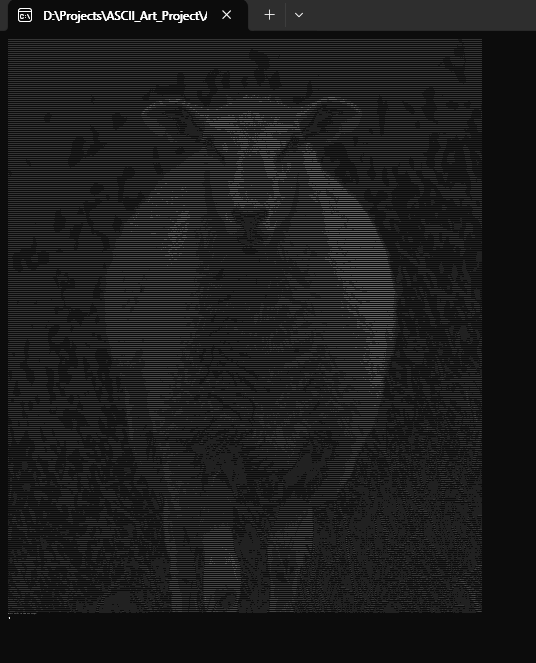
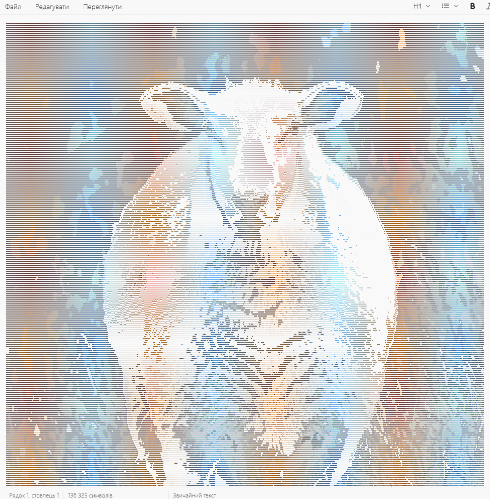

# ASCII Art Project

## Опис
**ASCII Art Project** — це консольний застосунок, що конвертує зображення в ASCII-арт. Результат можна побачити в консолі, а також у збереженому текстовому файлі.

## Функціональність
- Конвертація зображень у ASCII-арт
- Автоматичне змінення ширини зображення для кращого відображення
- Перетворення в градації сірого
- Створення звичайної та реверсивної версій ASCII-арту для кращого відображення в консолі і в текстовому редакторі
- Збереження результату в текстовий файл
- Логування процесу конвертації

## Результат роботи програми
### Вхідне зображення

### Результат конвертації в консолі

### Скріншот текстового файла

